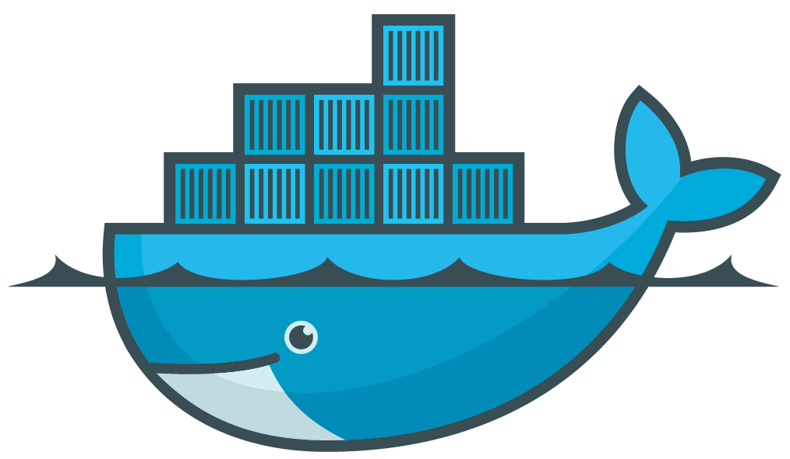
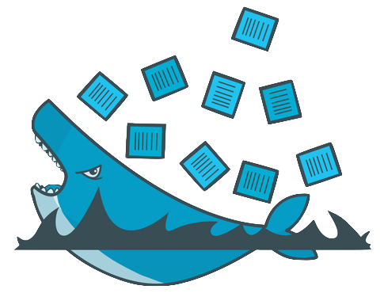
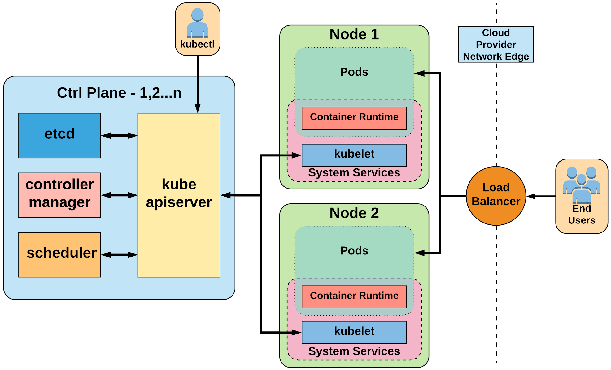

## Kubernetes: The Key to Hassle-Free and Durable Applications

_by_

Keyvan - Shovel Engineer

June 2023

---

## Introduction

- We know about the Docker <!-- .element: class="fragment" data-fragment-index="1" -->
- Enter Kubernetes <!-- .element: class="fragment" data-fragment-index="2" -->
- Key Feature of Kubernetes <!-- .element: class="fragment" data-fragment-index="3" -->
- Challenges <!-- .element: class="fragment" data-fragment-index="4" -->
- Questions <!-- .element: class="fragment" data-fragment-index="5" -->

---

## We know about the Docker and containers

--

 <!-- .element: height="250" -->

- You put the applications inside containers <!-- .element: class="fragment" data-fragment-index="1" -->
- Containers are isolated from each other <!-- .element: class="fragment" data-fragment-index="2" -->
- You ship the containers via Docker <!-- .element: class="fragment" data-fragment-index="3" -->
- Docker manages the containers in one machine <!-- .element: class="fragment" data-fragment-index="4" -->

--

### Sometimes things go wrong

 <!-- .element: height="500" -->

--

### Sometimes things go wrong

 <!-- .element: height="500" -->

--

### Sometimes things go wrong

 <!-- .element: height="500" -->

--

## Solution?

--

## Redundancy

 <!-- .element: height="250" -->

- Use multiple machines <!-- .element: class="fragment" data-fragment-index="1" -->
- When one machine goes down containers will be migrated to another machines <!-- .element: class="fragment" data-fragment-index="2" -->
- But Docker can manage containers only in one machine <!-- .element: class="fragment" data-fragment-index="3" -->

---

# Enter Kubernetes

--

 <!-- .element: height="250" -->

- In Greek kubernetes means "governor", "helmsman" or "captain" <!-- .element: class="fragment" data-fragment-index="1" -->
- As the name suggests it’s the governor for Docker containers and will manage the containers in multiple machines <!-- .element: class="fragment" data-fragment-index="2" -->
- It’s a container-orchestration solution <!-- .element: class="fragment" data-fragment-index="3" -->

--

## Architecture review

Note:
This diagram isn't very accurate but it's simple enough to explain things
Define what a node is
Define what a pod is

--

## Key Feature of Kubernetes

- Managing nodes
  -- Move applications when node is unavailable or out of resources
- Auto scaling applications and nodes
  -- Based on CPU, Memory and custom metrics
- No vendor lock in, easily move between different providers
- Service discovery & Load balancing
- Security measurements
  -- Namespaces
  -- Security and Network Policies
- Zero-downtime deployments
- Package management via Helm

---

Demo

    <!--
    {
        "URL": "https://asciinema.org/a/569727"
    }
    -->

